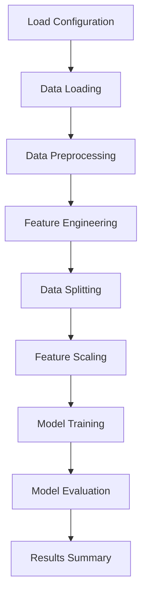

# ML Pipeline for Online Shopping Dataset

## Author Information
- Poon Heng Wah
- poonhwsing@yahoo.com.sg

## Overview of Submitted Folder
This submission contains a machine learning pipeline for analyzing the online shopping dataset. The folder structure is as follows:

```
.
├── src/
│   ├── __init__.py
│   ├── data_loader.py          # Data loading from SQLite
│   ├── preprocessor.py         # Data preprocessing and splitting
│   ├── feature_engineering.py  # Feature creation
│   ├── model_trainer.py        # Model training
│   ├── evaluator.py           # Model evaluation
│   └── pipeline.py            # Main orchestration script
├── config.yaml                # Configuration file
├── requirements.txt           # Python dependencies
├── run.sh                    # Executable script to run pipeline
└── README.md                 # This file
```

## Instructions for Executing the Pipeline

### Prerequisites
- Python 3.8+
- SQLite database file `online_shopping.db` in the root directory

### Installation
```bash
pip install -r requirements.txt
```

### Execution
```bash
./run.sh
```

Or directly:
```bash
python src/pipeline.py --config config.yaml
```

### Modifying Parameters
Parameters can be modified in `config.yaml`:

- **Database settings:** Change `database.path` and `database.table`
- **Preprocessing:** Adjust `preprocessing.test_size` and `preprocessing.random_state`
- **Models:** Add/remove models in the `models` list, modify parameters
- **Feature Engineering:** Toggle with `feature_engineering.enabled`

Command line options:
```bash
python src/pipeline.py --config custom_config.yaml
```

## Description of Logical Steps/Flow of the Pipeline



1. **Configuration Loading:** Read settings from YAML file
2. **Data Loading:** Connect to SQLite and load dataset
3. **Preprocessing:** Handle missing values, encode categorical variables
4. **Feature Engineering:** Create new features based on EDA insights
5. **Data Splitting:** Split into train/test sets with stratification
6. **Feature Scaling:** Standardize numerical features
7. **Model Training:** Train multiple ML models
8. **Evaluation:** Calculate metrics and generate confusion matrices
9. **Results Summary:** Log performance comparison

## Overview of Key Findings from EDA

From the exploratory data analysis:

- **Dataset Size:** 12,330 online shopping sessions
- **Target Variable:** PurchaseCompleted (binary: 0/1)
- **Key Predictors:**
  - PageValue: Strong positive correlation with purchases
  - BounceRate/ExitRate: Negative correlation with purchases
  - ProductPageTime: Mixed relationship
- **Data Quality:** Some missing values handled via imputation
- **Customer Types:** Mostly returning visitors
- **Conversion Rate:** ~15-20% purchase completion rate

## Feature Processing Summary

| Feature | Type | Processing | Description |
|---------|------|------------|-------------|
| CustomerType | Categorical | Label Encoding | New/Returning visitor |
| SpecialDayProximity | Numerical | Median Imputation | Days to special event |
| ExitRate | Numerical | Median Imputation | Session exit rate |
| PageValue | Numerical | Median Imputation | Average page value |
| TrafficSource | Numerical | None | Traffic source code |
| GeographicRegion | Numerical | None | Region identifier |
| BounceRate | Numerical | Median Imputation | Bounce rate |
| ProductPageTime | Numerical | Median Imputation | Time on product pages |
| PageValue_Category | Derived | Binning + Encoding | Categorized page value |
| Engagement_Score | Derived | Formula | Combined engagement metric |
| SpecialDay_Effect | Derived | Multiplication | Special day impact |

## Choice of Models

For this binary classification task, I selected:

1. **Logistic Regression:** Baseline linear model, interpretable, good for understanding feature importance
2. **Random Forest:** Ensemble method, handles non-linear relationships, robust to overfitting
3. **XGBoost:** Advanced boosting algorithm, often achieves high performance on tabular data
4. **SVM:** Support Vector Machine, effective for high-dimensional data with clear margins

These models provide a good mix of interpretability, performance, and computational efficiency.

## Model Evaluation

### Metrics Used
- **Accuracy:** Overall correct predictions
- **Precision:** True positives / (True positives + False positives)
- **Recall:** True positives / (True positives + False negatives)
- **F1-Score:** Harmonic mean of precision and recall
- **ROC-AUC:** Area under ROC curve, measures discriminative ability

### Expected Results
Based on EDA insights, models should perform reasonably well with PageValue as the strongest predictor. Random Forest and XGBoost are expected to outperform Logistic Regression due to non-linear relationships in the data.

## Other Considerations for Deploying the Models

1. **Model Persistence:** Save trained models using joblib/pickle for deployment
2. **Scalability:** Pipeline designed to handle larger datasets
3. **Monitoring:** Implement logging and performance tracking in production
4. **A/B Testing:** Framework supports easy model comparison
5. **Feature Store:** Consider implementing a feature store for real-time predictions
6. **API Development:** Models can be wrapped in REST API for integration
7. **Retraining:** Pipeline supports automated retraining with new data
8. **Explainability:** Use SHAP/LIME for model interpretability in production
